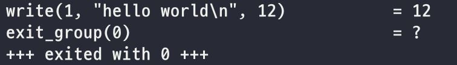
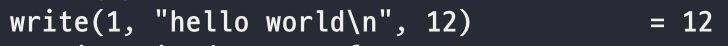
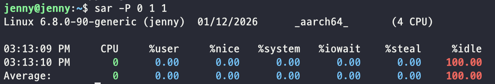
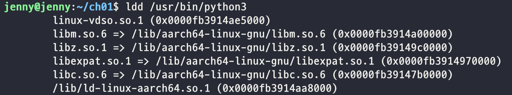

# 0. 시작하면서
이 책의 목적 : 컴퓨터 시스템을 구성하는 OS(Operating System: 운영체제)나 하드웨어를 실제로 Linux로 직접 동작을 확인하면서 배우는 것.
리눅스와 커널, 하드웨어가 상위 계층과 직접 연결된 부분을 배우고 이해.

## ubuntu 24.04.3-LTS 설치
<!--  -->
이미지 링크 : [https://ubuntu.com/download/server](https://ubuntu.com/download/server)

필요 패키지 설치

 
 

# 1. 리눅스 개요
## 프로그램과 프로세스
프로그램 : 컴퓨터에서 동작하는 관련된 명령 및 데이터를 하나로 묶은 것. 컴파일러형 언어(Go 등)라면 소스코드를 빌드해서 만들어진 실행 파일(executable file), 파이썬 같은 스크립트 언어는 소스 코드 그 자체를 의미. 커널도 프로그램의 일종. 프로세스보다 넒은 의미.
 
프로세스 : 실행되어서 동작 중인 프로그램

## 커널
모드(mode) 기능 : CPU에 내장되어 있는 기능으로 커널이 하드웨어의 도움을 받아 프로세스가 장치에 직접 접근을 할수 없도록 함.
- 커널 모드 : 아무 제약 없이 명령 실행. 리눅스의 경우 커널만이 커널 모드로 동작하여 장치에 접근.
- 사용자 모드: 사용자 공간(userland)에서 프로세스를 실행. 특정 명령은 실행하지 못하는 등의 제약. 리눅스의 경우 프로제스가 사용자 모드로 동작하여 장치에 직접 접근 불가(간접 접근).

커널 : 커널 모드로 동작. 장치 제어, 시스템 자원 관리 및 배분 기능 제공.

## 시스템 콜(System Call)
프로세스가 커널에 CPU의 특수한 명령을 실행해서 처리를 요청하는 방법으로 프로세스 생성, 하드웨어 조작과 같은 커널의 도움이 필요할 때 사용.

시스템  콜의 종류
- 프로세스 생성, 삭제
- 메모리 확보, 해제
- 통신 처리
- 파일 시스템 조작
- 장치 조작  
 

### 시스템 콜 호출 확인 실습

**strace 명령** : 프로그램 실행(프로세스) 시 호출하는 시스템 콜 출력.  
| 옵션 | 의미 | 대표 사용 예 | 주 사용 목적 |
|---|---|---|---|
| `-p PID` | 실행 중인 프로세스에 attach | `strace -p 1234` | 이미 떠 있는 프로세스 분석 |
| `-f` | 자식 프로세스까지 추적 | `strace -f cmd` | fork/exec 구조 파악 |
| `-o FILE` | 결과를 파일로 저장 | `strace -o trace.log cmd` | 로그를 남겨 분석 |
| `-tt` | 타임스탬프 출력 | `strace -tt cmd` | “언제” 발생했는지 확인 |
| `-T` | **syscall 소요 시간 표시** | `strace -T cmd` | 지연되는 syscall 찾기. %system 값이 높아져 구체적으로 어떤 시스템 콜에 시간이 지연되는지 확인하기 용이 |
| `-s N` | 문자열 최대 길이 지정 | `strace -s 256 cmd` | 긴 경로/데이터 일부라도 보기 |
| `-e trace=...` | 특정 syscall만 추적 | `-e trace=openat,read,write` | 로그량 축소, 핵심만 보기 |
| `-e trace=%file` | 파일 관련 syscall 그룹 | `-e trace=%file` | 파일/권한 문제 분석 |
| `-e trace=%network` | 네트워크 syscall 그룹 | `-e trace=%network` | connect/send/recv 문제 |
| `-c` | syscall 통계 요약 | `strace -c cmd` | 전체 병목 위치 파악 |
| `-yy` | FD/소켓 정보 자세히 출력 | `strace -yy cmd` | fd=3이 무엇인지 바로 확인 |
| `--` | 옵션 종료 구분자 | `strace -- cmd -x -y` | 대상 명령 인자 보호 |

---  
 

go strace 실습  

python strace 실습  

 

### 시스템 콜 처리 시간 비율 실습  
  
> 위 실습에서 %idle이 100.00으로 CPU는 거의 아무 일도 하지 않았다는 걸 확인.  

**taskset 명령** : 이 프로세스를 어느 CPU 코어에서 돌릴 것인지를 제어하는 도구.  

| 옵션 | 의미 | 대표 사용 예 | 주 사용 목적 |
|---|---|---|---|
| `-c` | CPU 코어를 번호로 지정 | `taskset -c 0 ./app` | 특정 코어에 고정 실행 |
| `-p` | 실행 중인 PID의 affinity 조회/변경 | `taskset -p 1234` | 현재 바인딩 상태 확인 |
| `-pc` | `-p` + `-c` 결합 | `taskset -pc 1,2 1234` | 실행 중인 프로세스 코어 변경 |
| `<mask>` | 비트마스크 방식 지정 | `taskset 0x3 ./app` | 스크립트/자동화용 |
| `-a` | (환경에 따라) 모든 스레드에 적용 | `taskset -apc 0 1234` | 멀티스레드 전체 고정 |

---
 

**sar(System Activity Report) 명령** : CPU, Memory, Disk IO, Networt 등 시스템 활동을 실시간으로 모니터링하는 강력한 성능 분석 도구  
| 옵션 | 의미 | 대표 사용 예 | 주 사용 목적 |
|---|---|---|---|
| `-u` | CPU 사용률 | `sar -u 1 5` | CPU idle/idle% 확인 |
| `-r` | 메모리 사용량 | `sar -r 1 5` | free, used, cache 상태 |
| `-S` | 스왑 사용량 | `sar -S 1 5` | swap in/out 확인 |
| `-b` | I/O 전송량 | `sar -b 1 5` | tps, read/write 부하 |
| `-d` | 디스크 I/O | `sar -d 1 5` | 디스크별 I/O 병목 |
| `-n DEV` | NIC 트래픽 | `sar -n DEV 1 5` | 인터페이스별 RX/TX |
| `-n TCP` | TCP 상태 | `sar -n TCP 1 5` | active/passive open |
| `-q` | Run queue / Load | `sar -q 1 5` | 시스템 대기열 |
| `-w` | Context Switch | `sar -w 1 5` | 문맥 전환 빈도 |
| `-P ALL` | CPU 코어별 | `sar -P ALL 1 5` | 코어 편중 여부 |
| `-f FILE` | 과거 로그 조회 | `sar -u -f /var/log/sa/sa12` | 장애 시점 복기 |
| `-s HH:MM:SS` | 시작 시각 | `sar -u -s 10:00:00 -f sa12` | 특정 시간대 분석 |
| `-e HH:MM:SS` | 종료 시각 | `sar -u -s 10:00:00 -e 11:00:00 -f sa12` | 구간 슬라이싱 |

---

%system : 커널이 시스템 콜을 처리한 시간 비율   
%idle : 아무 것도 하지 않는 아이들 상태 비율  

**모니터링**
: 시스템 통계 정보를 수집, 관리하는 구조를 지칭. Prometheus, Zabbix, Datadoc 등이 있음.  
**알림 도구**
: 정상 상태를 미리 정의하고, 이상이 발생하면 통지하는 경고 알림 기능. 모니터링 도구와 함께 사용하거나 독립적으로 사용하는 Alert Manager도 있음.  
**대시보드**
: 이상 상태 발생 시 수집한 데이터를 가시화하여 대시 보드로 보여줌. 모니터링 도구, 알림 도구와 함께 사용하거나 독립 소프트웨어인 Grafana Dashboards도 있음.  
 

### 라이브러리
OS가 제공하는 라이브러리는 여러 프로그램이 공통으로 쓰는 기능을 미리 모아둔 도구 상자이며, 개발자는 필요한 것만 골라 더 빠르고 안정적으로 프로그램을 만들 수 있음.  
- 정적 라이브러리 : 링크할 때 라이브러리에 있는 함수를 프로그램에 집어 넣음.  
- 동적 라이브러리 : 링크할 때 '이 라이브러리의 이런 함수를 호출한다'라는 정보만 실행 파일에 포함. 프로그램을 시작하거나 실행 중에 라이브러리를 메모리에 로드하고 프로그램은 그 안에 있는 함수 호출.  

**표준 C 라이브러리** : 표준 C 라이브러리(국제 표준화 기구(ISO)에서 정한 표준 라이브러리)로 리눅스에서도 제공. 일반적으로 GNU 프로젝트에서 제공하는 glibc(이하 libc)를 표준 라이브러리로 사용.  
- python3 라이브러리 확인  
    

**시스템 콜 래퍼(wrapper) 함수** : libc가 제공. 시스템 콜은 일반 함수 호출과는 달리 C 언어와 같은 고급 언어에서 직접 호출 불가. 아키텍처에 의존하는 어셈블리 코드를 통해 호출.  

