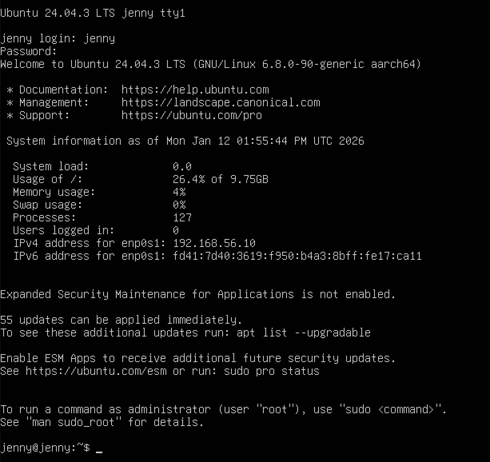
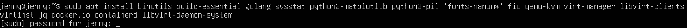
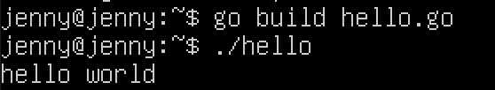

# 0. 시작하면서
이 책의 목적 : 컴퓨터 시스템을 구성하는 OS(Operating System: 운영체제)나 하드웨어를 실제로 Linux로 직접 동작을 확인하면서 배우는 것.
리눅스와 커널, 하드웨어가 상위 계층과 직접 연결된 부분을 배우고 이해.

## ubuntu 24.04.3-LTS 설치
<!--  -->

필요 패키지 설치

 
 

# 1. 리눅스 개요
## 프로그램과 프로세스
프로그램 : 컴퓨터에서 동작하는 관련된 명령 및 데이터를 하나로 묶은 것. 컴파일러형 언어(Go 등)라면 소스코드를 빌드해서 만들어진 실행 파일(executable file), 파이썬 같은 스크립트 언어는 소스 코드 그 자체를 의미. 커널도 프로그램의 일종. 프로세스보다 넒은 의미.
 
프로세스 : 실행되어서 동작 중인 프로그램

## 커널
모드(mode) 기능 : CPU에 내장되어 있는 기능으로 커널이 하드웨어의 도움을 받아 프로세스가 장치에 직접 접근을 할수 없도록 함.
- 커널 모드 : 아무 제약 없이 명령 실행. 리눅스의 경우 커널만이 커널 모드로 동작하여 장치에 접근.
- 사용자 모드: 사용자 공간(userland)에서 프로세스를 실행. 특정 명령은 실행하지 못하는 등의 제약. 리눅스의 경우 프로제스가 사용자 모드로 동작하여 장치에 직접 접근 불가(간접 접근).

커널 : 커널 모드로 동작. 장치 제어, 시스템 자원 관리 및 배분 기능 제공.

## 시스템 콜(System Call)
프로세스가 커널에 CPU의 특수한 명령을 실행해서 처리를 요청하는 방법으로 프로세스 생성, 하드웨어 조작과 같은 커널의 도움이 필요할 때 사용.

시스템  콜의 종류
- 프로세스 생성, 삭제
- 메모리 확보, 해제
- 통신 처리
- 파일 시스템 조작
- 장치 조작

 

**시스템 콜 호출 확인 실습**

