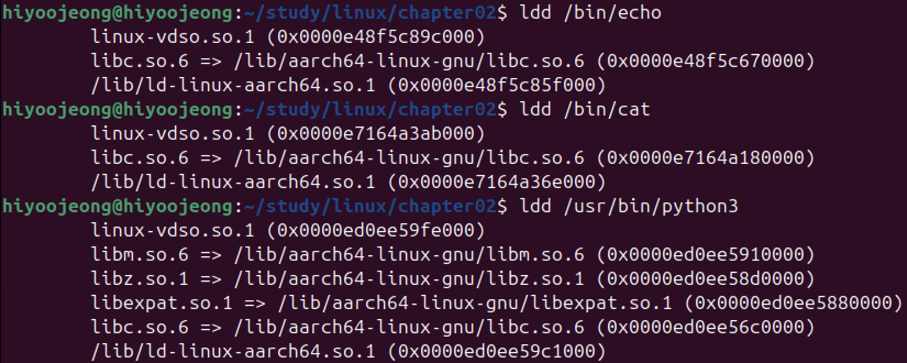

# ldd 명령어를 통해 링크하는 라이브러리 확인

- ldd : 프로그램이 어떤 라이브러리를 링크하는지 확인 가능

echo, cat, python3 명령어 모두 libc 라이브러리를 링크하고 있다.
( 파이썬 프로그램을 실행할 때 내부적으로는 표준 C 라이브러리를 사용한다. )

> libc.so.6 : 표준 C 라이브러리.   
ld-linux-aarch64.so.1 : 공유 라이브러리를 로드하는 특별한 라이브러리