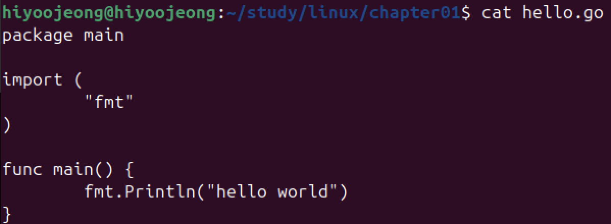
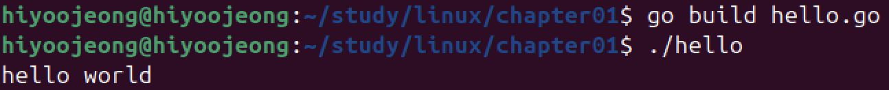
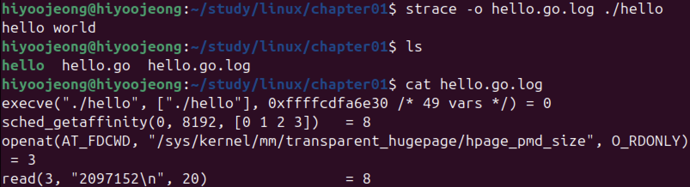
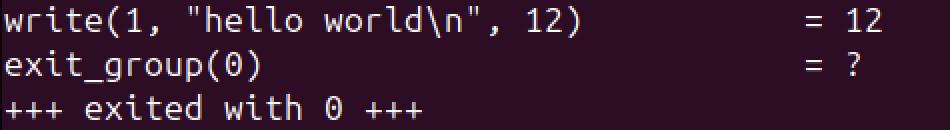
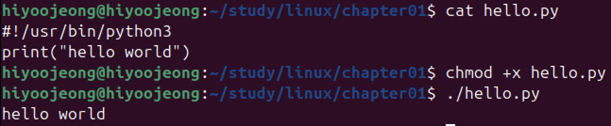
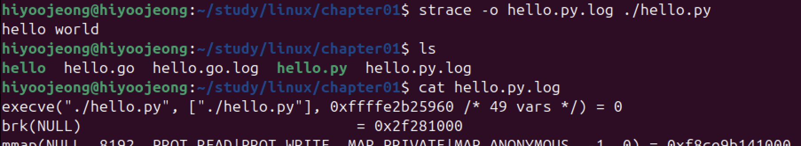
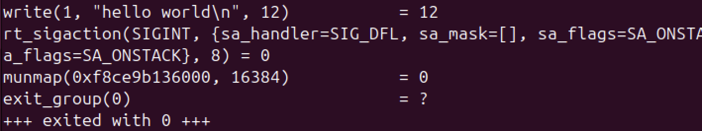

# 시스템 콜 호출 확인해 보기

어떤 프로그래밍 언어로 만들어졌든지 프로그램은 커널에 처리를 요청하려면 시스템 콜을 호출한다.

Go, Python 언어로 작성한 프로그램을 실행하며 비교해보자.

## Go

1. 소스코드 작성한 뒤 build 하여 실행파일 생성

2. 시스템 콜을 호출하는지 strace 출력 결과 확인
- strace : 프로그램이 어떤 시스템 콜을 호출하는 지 확인
- -o : strace 출력 결과를 파일로 저장

3. write() 시스템 콜 호출하는 것 확인

## Python

4. 소스코드 작성

1. 시스템 콜을 호출하는지 strace 출력 결과 확인
- strace : 프로그램이 어떤 시스템 콜을 호출하는 지 확인
- -o : strace 출력 결과를 파일로 저장

1. write() 시스템 콜 호출하는 것 확인

