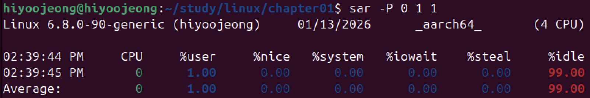
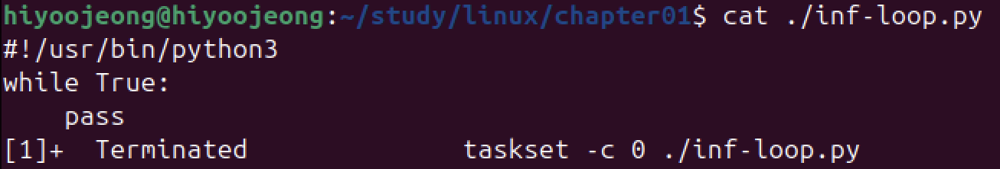
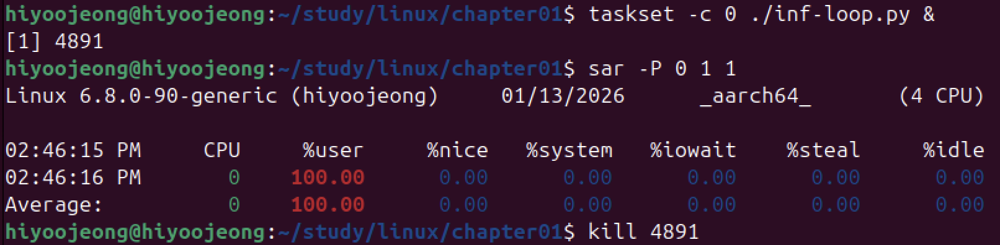
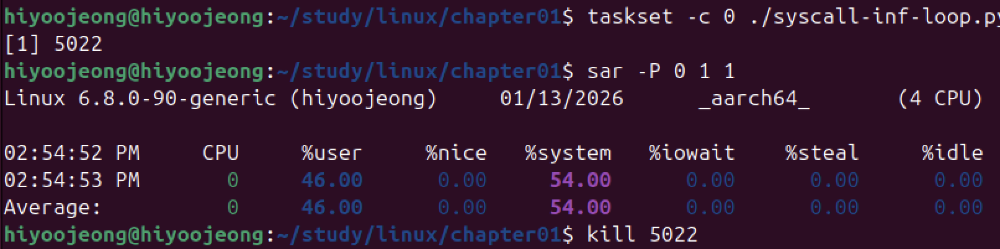
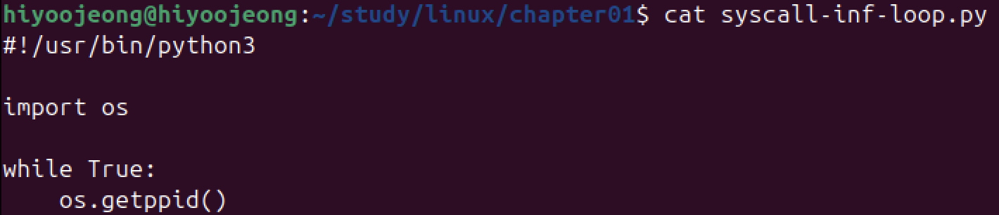

# 시스템 콜을 처리하는 시간 비율

## 아무것도 하지 않을 때

1. 확인

- sar : 시스템에 설치된 논리 CPU(커널이 CPU로 인식하고 있는 대상)가 실행하고 있는 명령 비율
- -P 0 : 논리 CPU 0의 데이터를 수집
- 1 : 1초마다 수집
- 1 : 한 번만 데이터를 수집

> %user ~ %idle 까지 여섯 종류로 각각 % 단위.  
사용자 모드에서 프로세스를 실행하는 시간 비율 : %user ~ %nice  
커널이 시스템 콜을 처리한 시간 비율 : %system
아무 것도 하지 않는 상태의 시간 비율 : %idle   

> **%idle = 99%**.  
**현재 CPU 0 는 거의 아무것도 하지 않았다.**

## 무한루프 프로그램이 동작할 때

1. 코드 작성

2. 확인

- taskset -c <논리 CPU 번호> <명령어> : 지정한 논리 CPU에서 실행

> **%user = 100%**  
**현재 CPU 0 는 사용자 모드에서 프로세스를 거의 실행 중이다.**

## 시스템 콜을 호출하는 무한루프 프로그램이 동작할 때

1. 코드 작성

2. 확인

> **%user = 46%, %system 54%**.  
**현재 CPU 0 는 사용자 모드에서 프로세스를 거의 실행 중이다.**