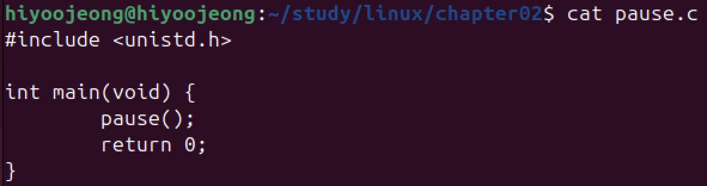
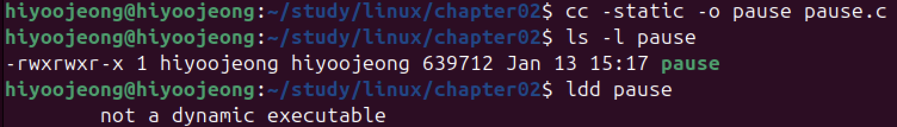
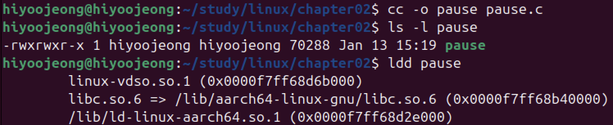

# 정적 라이브러리 vs 공유 라이브러리 실습

< 실습코드 >

1. 정적 라이브러리 인 libc.a 를 사용한 경우

- 프로그램 크기 : 약 640KiB
- 공유 라이브러리 링크 여부 : X

2. 공유 라이브러리 libc.so 를 사용한 경우

- 프로그램 크기 : 약 70KiB
- 공유 라이브러리 링크 여부 : O

⇒ libc 가 프로그램 자체에 포함되는 게 아니라 **실행 시 메모리에 로드**되기 때문에 **비교적 파일 크기가 작다.**

< 공유 라이브러리를 자주 사용하는 이유 >

- 시스템에서 차지하는 크기를 줄일 수 있음
- 라이브러리에 문제가 있을 때 공유 라이브러리만 수정하면 됨

< 정적 라이브러리를 자주 사용하는 이유 >

- 대용량 메모리나 저장 장치가 널리 사용되어, 파일 크기 문제는 별 문제가 아니게 됨
- 실행 파일 하나만으로 프로그램이 동작하므로, 해당 파일만 복사하면 다른 환경에서도 동작하여 편리함
- 실행 시 공유 라이브러리 링크하지 않아, 시작시간이 비교적 빠름
- 공유 라이브러리 버전업에 따른 기존 실행 프로그램 호환성 문제 생길 수 있음

( Go 언어는 기본적으로 라이브러리를 모두 정적 링크한다.)