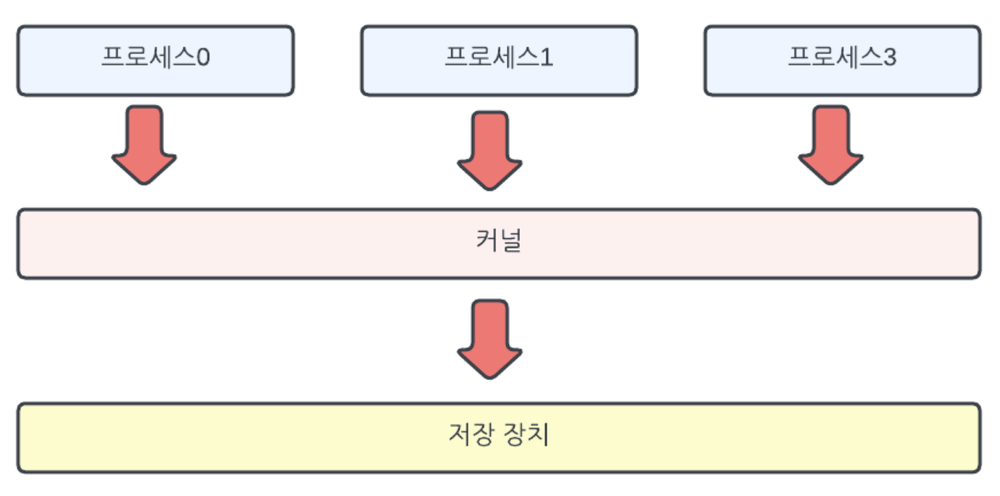
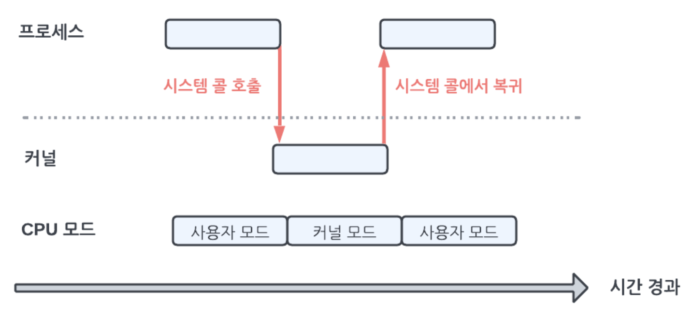
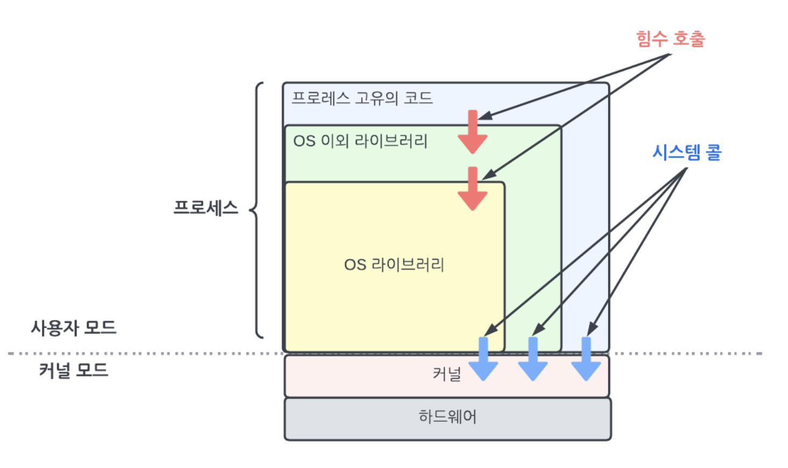
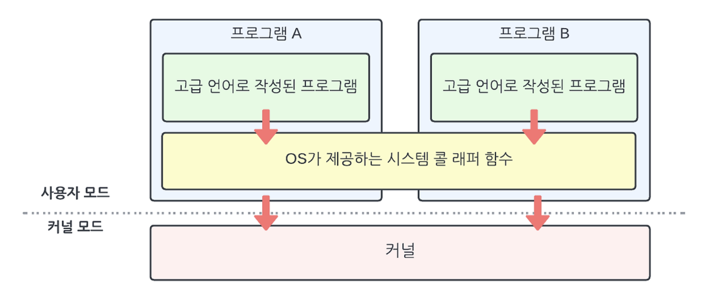
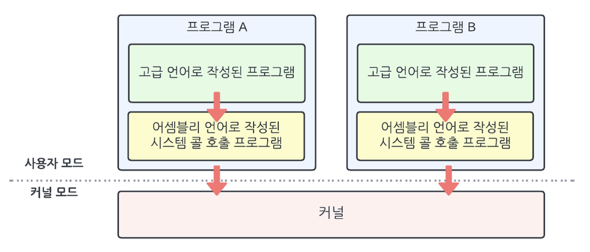

# 제1장 리눅스 개요


## 프로그램과 프로세스

**프로그램**이란 **컴퓨터에서 동작하는 관련된 명령 및 데이터를 하나로 묶은 것**이다.

**프로세스**란 **실행 중인 프로그램**이다.

> **커널**도 프로그램의 일종이다.   
컴퓨터를 켜면 처음에 커널이 실행된다. 그외 모든 프로그램은 커널 이후에 실행된다.

컴파일러(compiler)형 언어는 소스코드를 빌드(build)해서 실행 가능한 파일인 프로그램을 만든다.   
스크립트(script)형 언어는 소스코드 자체가 프로그램이다.


## 커널

**커널**은 **하드웨어 도움을 받아 프로세스가 장치에 직접 접근할 수 없도록 한다.**    
구체적으로는 CPU에 내장된 ‘모드(mode)’ 기능을 사용한다.    
일반적인 CPU에는 **커널 모드**와 **사용자 모드** 가 있다.

커널 모드로 실행하면 아무런 제약없이 동작이 가능하지만, 리눅스의 경우 오직 **커널**만 **커널 모드**로 동작한다.    
사용자 모드로 실행하면 동작에 제약이 걸리며, **프로세스**의 경우 **사용자 모드**로 동작한다.    
따라서, **프로세스**는 **커널**을 통해서 **간접적**으로 장치에 접근한다.

> 프로세스가 장치에 직접 접근하는 경우, 동시성 문제가 발생할 수 있기 때문이다.

- 커널 모드로 동작
- 다른 프로세스에서는 불가능한 기능 제공 (장치 제어, 시스템 공유 자원 관리 및 프로세스에 배분)



## 시스템 콜

**시스템 콜**(**System Call**)은 **프로세스가 커널에 처리를 요청하는 방법**이다.

< 시스템 콜 종류 >
- 프로세스 생성, 삭제
- 메모리 확보, 해제
- 통신 처리
- 파일 시스템 조작
- 장치 조작

< 시스템 콜의 모드 전환 매커니즘 >

- 프로세스는 사용자 모드로 실행되지만, 커널 모드로 실행해야 하는 특수 작업이 필요한 경우가 있다.
- 작업을 위해 프로세스는 ‘**시스템 콜**’을 호출하여 처리를 요청한다.
- 이때, CPU에서는 예외(exception)라는 이벤트가 발생한다.
- 이를 계기로 CPU 모드가 사용자 모드에서 커널 모드로 변경되며, 커널 처리가 동작한다.
- 커널 내부에서 시스템 콜 처리가 끝나면 CPU 모드가 커널 모드에서 사용자 모드로 돌아와 프로세스 동작을 이어서 진행한다.

> 시스템 콜 처리 전, 커널은 프로세스에서 온 요청이 올바른지 확인하고 처리한다.



[시스템 콜 호출 확인해 보기](./실습/시스템%20콜%20호출%20확인해%20보기.md)

[시스템 콜을 처리하는 시간 비율](./실습/시스템%20콜을%20처리하는%20시간%20비율.md)

[시스템 콜 소요 시간](./실습/시스템%20콜%20소요%20시간.md)

## 라이브러리

**라이브러리**는 공통된 기능을 묶어 놓은 것이다.

OS가 미리 공통된 기능을 가진 라이브러리를 준비해서 제공하는 경우도 있다.



### 표준 C 라이브러리

C 언어는 국제 표준화 기구(ISO)에서 정한 표준 라이브러리가 존재한다.    
리눅스에서도 이런 표준 C 라이브러리가 제공된다.     
일반적으로 GNU 프로젝트에서 제공하는 glibc(=libc) 를 표준 C 라이브러리로 사용한다.

C 언어로 작성된 대부분의 C 프로그램은 libc 를 링크(linking) 한다.

[ldd 명령어를 통해 링크하는 라이브러리 확인](./실습/ldd%20명령어를%20통해%20링크하는%20라이브러리%20확인.md)

### 시스템 콜 래퍼 함수

libc 는 표준 C 라이브러리 뿐만 아니라 시스템 콜 래퍼(wrapper) 함수도 제공한다.    
시스템 콜은 C 언어와 같은 고급 언어에서 직접 호출할 수 없으며, 아키텍처에 의존하는 어셈블리 코드를 사용해 호출해야 한다.

< x86_64 에서 getppid() 호출부 vs arm64 에서 getppid() 호출부 >

```nasm
; x86_64
mov    $0x6e, %eax
syscall
```

```nasm
; arm64
mov    x8 <시스템 콜 번호>
svc    #0
```

아키텍처 별로 어셈블리 코드 레벨에서 getppid() 시스템 콜을 호출하는 방식이 다르다.

만약 시스템 콜 래퍼 함수가 없었다면, 아키텍처 의존 어셈블리 코드를 작성해서 고급언어에서 계속 호출해야 한다.    
**→ 아키텍처 종속성, 재사용 불가능, 유지보수 어려움**



libc 에서 시스템 콜을 호출할 뿐만 아니라, 시스템 콜 래퍼 함수를 제공해준다. 래퍼 함수는 아키텍처 별로 존재한다.    
고급 언어 사용자는 언어마다 준비된 시스템 콜의 래퍼 함수를 호출하기만 하면 된다.



### 정적 라이브러리와 공유 라이브러리

라이브러리는 **정적(static) 라이브러리**와 **공유(shared) 또는 동적(dynamic) 라이브러리**로 분류할 수 있다.

1. 소스 코드를 컴파일해서 오브젝트(object) 파일 생성
2. 오브젝트 파일이 사용하는 라이브러리를 링크해서 실행 파일 생성
    1. 라이브러리에 있는 **함수**를 프로그램에 집어 넣어서 링크한다? **정적 라이브러리**
    2. 사용하는 라이브러리 **함수 정보만** 프로그램에 집어 넣고, **실행 중에** 라이브러리를 **메모리에 로드(load)**하여 함수 호출한다? **동적 라이브러리**

[정적 라이브러리 vs 공유 라이브러리 실습](./실습/정적%20라이브러리%20vs%20공유%20라이브러리%20실습.md)