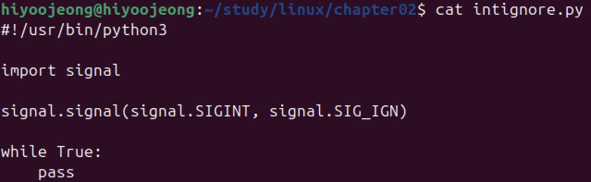
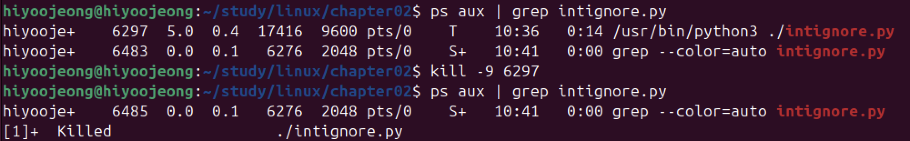

# SIGINT 시그널을 무시하는 시그널 핸들러 등록하기

1. SIGINT 시그널에 대해 SIG_IGN 시그널 핸들러를 등록하여, Ctrl + C 에도 프로세스가 종료되지 않는 프로그램 작성

2. 실행

- Ctrl + C 입력하여 SIGINT 시그널을 보내도 프로세스 종료되지 않음
    - 일단, Ctrl + Z 입력하여 백그라운드 처리로 변경
- jobs : 현재 터미널의 백그라운드 작업들 리스트 출력

3. 프로세스 강제종료

- kill 명령어로 SIGKILL 시그널 보내어 프로세스 강제 종료