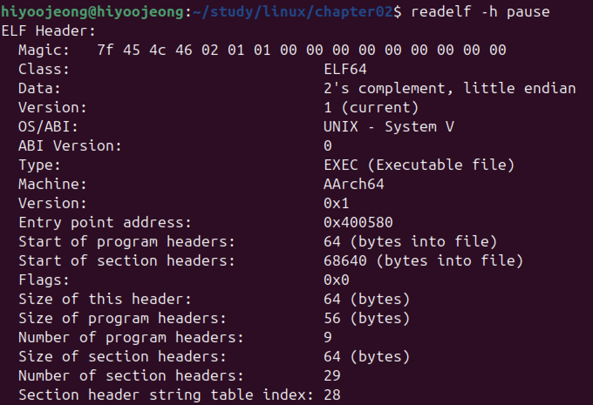
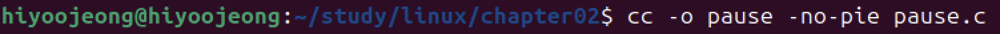
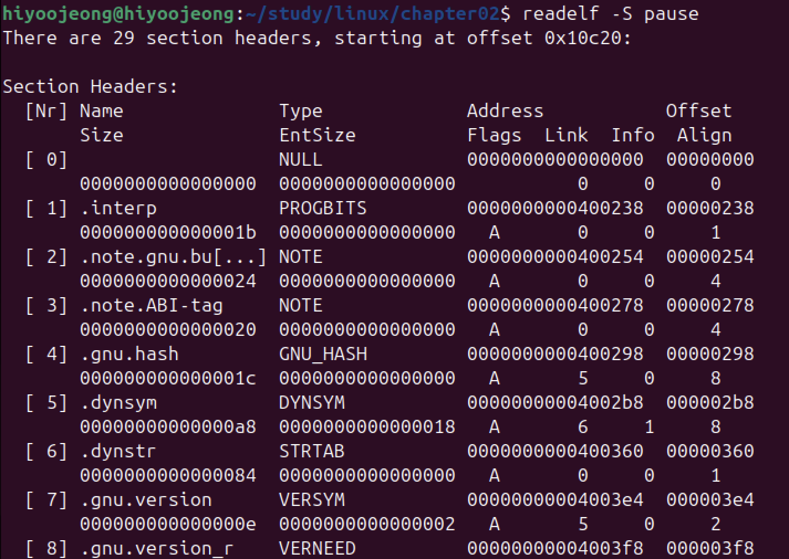

# readelf 활용하여 ELF 각종 정보 확인해보기

프로그램 빌드

- -no-pie 옵션 : PIE 빌드 무효화

1. 프로그램 시작 주소 확인하기

- readelf -h : 프로그램 시작주소 확인 명령어
    - Entry point address : 0x400580 확인할 수 있음

2. 코드와 데이터의 파일 오프셋, 크기, 시작 주소 확인하기

- readelf -S : 코드와 데이터의 파일 오프셋, 크기, 시작 주소 확인 명령어
    - 실행 파일은 여러 섹션(section) 으로 나눠져 있음
    - 섹션 주요 정보
        - Name : 섹션명 ( .text - 코드섹션, .data - 데이터 섹션 )
        - Address : 메모리 맵 시작 주소
        - Offset : 파일 오프셋
        - Size : 크기