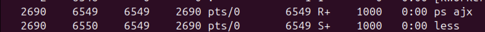

1. 명령어 실행
```bash
ps ajx | less
```

2. 프로세스 그룹 확인



- PID = 6549 (ps ajx) 프로세스를 파이프 ( | ) 로 연결한 PID = 6550 (less) 프로세스가 있는 그룹

> PGID = 6549 인 프로세스 그룹  
>>PID = 6549 (ps ajx) 인 프로세스   
PID = 6550 (less) 인 프로세스