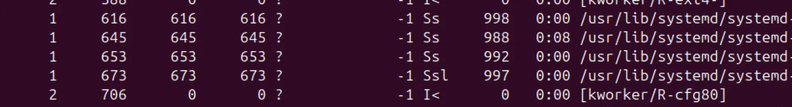
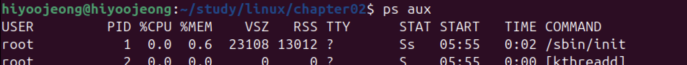
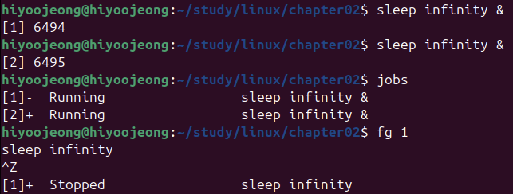
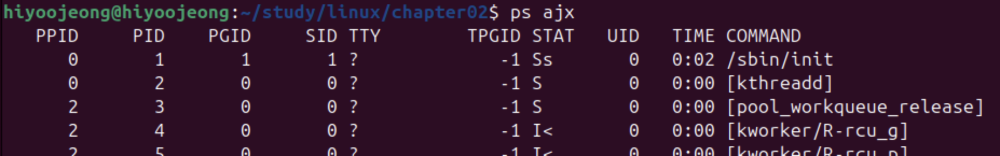

# 제2장 프로세스 관리(기초편)

## 프로세스 생성

새로운 프로세스 생성 목적    
1. 동일한 프로그램 처리를 여러 프로세스에 나눠서 처리하기
2. 다른 프로그램을 생성하기

### 같은 프로세스를 두 개로 분열시키는 fork() 함수

**fork()** 함수를 호출하면 해당 프로세스의 **복사본**을 만들고 양쪽 모두 fork() 함수에서 복귀한다.    
원본 프로세스를 부모 프로세스(parent process), 생성된 프로세스를 자식 프로세스(child process)라고 부른다.

< fork() 함수 호출 시 작업 순서 >

1. 부모 프로세스가 fork() 함수 호출
2. 자식 프로세스용 메모리 영역 확보 후 그곳에 부모 프로세스의 메모리를 복사
3. 부모 프로세스와 자식 프로세스는 fork() 함수에서 복귀
    - fork() 반환값에 따른 처리 분기 가능
        - 부모 프로세스 반환값 : 자식 프로세스의 프로세스 ID
        - 자식 프로세스 반환값 : 0

### 다른 프로그램을 기동하는 execute() 함수

fork() 함수를 통해 프로세스 복사본을 만든 후,    
자식 프로세스에서 **execve()** 함수를 호출하면 자식 프로세스는 **새로운 프로그램**으로 바뀐다.

< execve() 함수 호출 시 작업 순서 >

1. 자식 프로세스가 execve() 함수 호출
2. execve() 함수 인수로 지정한 실행 파일에서 프로그램을 읽은 후 메모리에 배치(메모리 맵)하는 데 필요한 정보를 가져옴
3. 현재 프로세스 메모리를 새로운 프로세스 데이터로 덮어씀
4. 프로세스를 새로운 프로세스의 최초 실행 명령(엔트리 포인트, entry point)부터 실행 시작

execve() 함수가 동작하려면 실행 파일은 아래 정보를 알아야 한다.  

- 코드 영역의 파일 오프셋, 크리 및 메모리 맵 시작 주소
- 데이터 영역의 파일 오프셋, 크리 및 메모리 맵 시작 주소
- 최초로 실행할 명령의 메모리 주소(엔트리 포인트)    
리눅스 실행 파일은 Executable and Linking Format(ELF) 포맷을 사용하여 해당 정보를 확인한다.

[readelf 활용하여 ELF 각종 정보 확인해보기]()

### ASLR 보안 강화

**ASLR**(**Addredd Space Layout Randomization**)은 프로그램 실행때마다 각 섹션을 다른 주소에 매핑하는 보안 기능이다.    
→ 섹션이 고정된 특정 주소에 존재하지 않아 공격이 어려워짐

< ASLR 기능 이용 조건 >

- 커널의 ASLR 기능이 유효한 상태여야 함
    - 우분투 20.04는 기본 설정
- 프로그램이 ASLR에 대응해야 하는데, 대응 프로그램이 PIE(Position Independent Executable)이다.
    - 우분투 20.04 gcc는 프로그램을 PIE로 빌드하는 것이 기본 설정

> 앞서 -no-pie 옵션이 PIE 빌드를 무효화하였기 때문에 실습 과정에서 고정된 주소 확인 가능했음    
프로그램의 PIE 지원 여부는 file 명령어로 확인 가능

## 프로세스의 부모 자식 관계

프로세스를 새로 생성하려면 부모 프로세스가 자식 프로세스를 생성해야 한다. 즉, 최상위 부모 프로세스가 존재한다.    
모든 프로세스의 조상인 최상위 프로세스는 pid=1 인 init 프로세스(systemd)이다.

[pstree 활용한 init 프로세스 확인 실습]()

> < posix_spawn() 함수 사용한 프로세스 생성 방법 >    
유닉스 계통 OS 의 C 언어 인터페이스 규격인 POSIX에 정의된 함수이다.    
‘fork(), execve() 함수 순서대로 호출 후 반환값에 따른 분기 처리’ 대신 해당 함수 사용하여 간단하게 프로세스를 생성할 수 있다.

## 프로세스 상태

ps 출력 결과 STAT 필드 첫 번째 글자

- S : 슬립(sleep) 상태 - 프로세스 실행된 후 어떤 이벤트 발생될 때까지 CPU 사용하지 않고 가만히 있음
- R : 실행 가능(runnable) 상태 - CPU를 사용하고 싶어하는 상태
      실행(running) 상태 - 실제로 CPU를 사용하는 상태
- Z : 좀비(zombie) 상태 - 프로세스 종료 시 잠깐 좀비 상태가 되었다가 소멸
- D(특수상태) : 어떤 이유(네트워크나 지스크 자원 요청 대기 등)로 시그널을 받아들이지 않는 uninterruptible sleep 상태
    - 이때, SIGKILL로 종료할 수 없는 경우가 발생할 수 있음

> 시스템의 모든 프로세스가 슬립 상태라면 논리 CPU는 아이들(idle) 프로세스를 동작시킨다.    
아이들(idle) 프로세스는 ‘아무 일도 하지 않는’ 특수한 프로세스이다.    
논리 CPU를 휴식 상태로 전환하여, 하나 이상의 프로세스가 실행 가능 상태가 될 때까지 소비 전력을 억제하며 대기한다.

## 프로세스 종료

'**자식 프로세스**'에서 프로세스 종료하기 위해서는 **exit_group**() 시스템 콜을 호출하여, 커널이 메모리 같은 자원을 회수한다.    
exit() 함수 호출 시 내부적으로 exit_group() 시스템 콜 호출하며, 호출하지 않아도 libc 등 내부적으로 호출한다.

'**부모 프로세스**'에서 **wait**()이나 **waitpid**() 같은 시스템 콜을 호출하여 자식 프로세스의 반환값, 정상종료여부, CPU사용시간 등의 정보를 확인할 수 있다.    
[wait 활용하여 백그라운드 프로세스 종료 상태 확인 실습]()    
⇒ 즉, 부모 프로세스에서 wait() 계열 시스템 콜을 호출하지 않으면, 종료된 자식 프로세스 정보가 시스템 내에 잔류하게 된다.

- 좀비(zombie) 프로세스 : 부모가 종료 상태를 확인하지 않은 상태의 프로세스
- 고아(orphan) 프로세스 : 부모가 종료 상태를 확인하지 않은 채로 종료되었을 때의 자식 프로세스
    - 이때, 커널은 init 을 고아 프로세스의 새로운 부모로 지정한 뒤 자원을 회수한다.

## 시그널

프로세스는 기본적으로 어떤 실행 순서에 따라 실행된다.   
**시그널**(signal)은 외부에서 실행 순서를 강제로 바꾸는 방법이다.

- SIGINT : 프로세스를 종료(기본값)하라고 보내는 시그널
    - 셸에서 Ctrl + C 눌렀을 때 혹은 kill 명령어를 사용할 때 발생
- SIGCHLD : 자식 프로세스 종료 시 부모 프로세스에 보내는 시그널
    - 보통 시그널 핸들러 내부에서 wait() 계열 시스템 콜 실행을 호출
- SIGSTOP : 프로세스 실행을 일시적으로 정지하라고 보내는 시그넝
    - 셸에서 Ctrl + Z 눌렀을 때
- SIGCONT : SIGSTOP 등으로 정지한 프로세스 실행을 재개

**시그널 핸들러**(Signal Handler)는 **프로세스가 시그널을 받았을 때 실행되는 함수**이다.   
시그널 핸들러는 시그널을 받았을 때 기본 동작 대신 사용자가 정의한 동작을 수행한다.   
[SIGINT 시그널을 무시하는 시그널 핸들러 등록하기]()

## 셀 작업 관리 구현

### 세션

**세션**(session)은 germ 같은 단말 에뮬레이터(terminal emulator) 또는 ssh 등을 사용해서 시스템에 로그인했을 때의 로그인 세션에 대응하는 개념이다.

모든 세션에는 해당 세션을 제어하는 단말(termianl)이 존재한다.

- 보통 pty/<n> 이름을 가진 가상 단말이 각 세션에 할당

세션에는 세션ID(SID) 라는 값이 할당된다.   
세션에는 세션리더 프로세스가 존재하며, 세션리더 PID = 세션 SID 이다.   
세션에서 실행된 명령어는 세션에 소속된다.

< ps ajx 명령어 확인 >

- SID 필드 값이 세션 ID이다.
- TTY 필드 값이 단말의 이름이다.
- PID = SID 가 동일하다면 세션 리더 프로세스이다.

세션 연결이 끊기면, 세션리더 프로세스에  SIGNUP 시그널이 간다.    
( 단말이 hang up하는 경우, 단말 에뮬레이터 창을 닫는 경우 등 )   
이때, 세션리더 프로세스는 세션 내 관리하던 프로세스를 종료시고 자신도 종료시킨다.

- SSH 연결이 끊어지면 → SIGHUP 발생 → 프로세스 종료

< 세션 종료에도 프로세스 유지 방법 >

- nohup 명령어 : SIGHUP 시그널 무시하여 프로세스 유지
- bash의 disow 내장 명령어 : bash 관리 대상에서 제외
    - 세션리더 프로세스 종료되더라도 해당 세션 내 작업이 종료되지 않음

### 프로세스 그룹

**프로세스 그룹**은 여러 프로세스를 하나로 묶어 한꺼번에 관리한다.   
세션 내부에는 여러 프로세스 그룹이 존재한다.

프로세스 그룹을 사용하면 해당하는 모든 프로세스에 접근 가능하며, 작업 제어가 가능하다.   
프로세스 그룹에는 고유 ID인 PGID가 할당된다.

< 프로세스 그룹 2종류 >

- 포그라운드(foreground) 그룹 : 셸에 포그라운드 작업에 대응
    - 세션 당 하나만 존재
    - 단말에 직접 접근 가능
- 백그라운드(background) 그룹 : 셸에 백그라운드 작업에 대응
    - 단말에 접근 시 실행 일시중단되며, 포그라운드 작업이 될 때까지(fg 명령어 사용 등) 대기

> 단말에 직접 접근하려면 프로그라운드 프로세스 그룹(포그라운드 작업)이 된 이후에 가능하다!

[파이프를 통한 프로세스 그룹 이해하기]()

## 데몬

**데몬**(demon)은 상주하는 프로세스이다.

보통의 프로세스와 달리 시스템 시작부터 종료까지 계속 존재하며 실행된다.

< 데몬 특징 >

- 단말 입출력이 필요없기에 단말 할당X
    - 단말의 행업을 뜻하는 SIGHUP 시그널을 설정파일을 다시 읽는 시그널로 사용
- 로그인 세션 종료에도 영향받지 않으며, 독자적인 세션을 가짐
- 데몬 프로세스의 부모 프로세스는 init